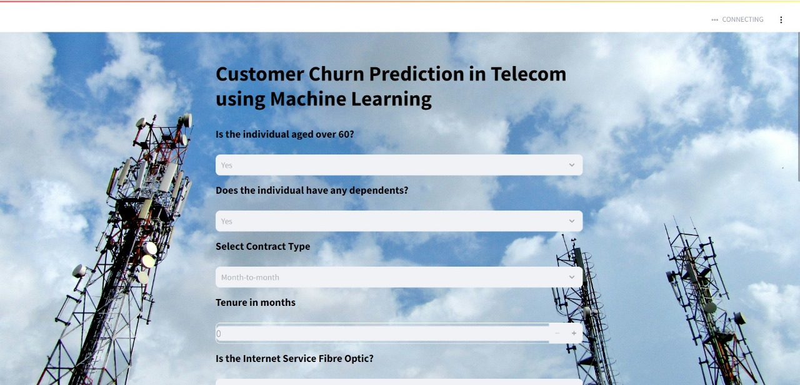

# A-Project-on-Customer-Churn-Prediction-in-Telecom-using-Machine-learning
This project aims to predict customer churn in the telecom industry using machine learning techniques. By analyzing customer data such as service usage, contract details, and demographic information, we build predictive models to identify customers at risk of leaving.
# Model Prediction and Deployment

Here’s a snapshot of the customer churn prediction interface:

Introduction

Customer churn, where customers discontinue their service, poses a significant financial challenge for telecom providers. Predicting which customers are likely to churn allows companies to implement targeted strategies to retain them, enhancing customer satisfaction and reducing revenue losses.

Problem Definition

The objective of this project is to build a model that predicts the likelihood of a customer churning based on historical data. Using the predictive insights, telecom companies can improve customer retention strategies and minimize attrition.

Objectives

Data Exploration: Understand feature distributions and relationships.

Feature Engineering: Create and select the most informative features.

Model Development: Train and evaluate machine learning models.

Model Evaluation: Assess model performance with accuracy, precision, recall, and F1-score.

Business Insights: Provide actionable insights for targeted retention strategies.

Dataset

Source: Kaggle - Telco Customer Churn

Description: 7,043 records with 21 features including demographics, account information, and customer service usage.

Target Variable: Churn (indicating if a customer has churned or not).

Methodology

Data Preprocessing

Missing Values: Replaced missing values in the TotalCharges column with 0.

Encoding: Categorical features were converted to numerical values using Label Encoding and One-Hot Encoding.

Scaling: Min-Max scaling was applied to numerical features to ensure uniformity.

Exploratory Data Analysis

Univariate Analysis: Analyzed individual features to understand distributions.

Bivariate Analysis: Examined relationships between features and the target variable (Churn).

Feature Engineering and Selection

Feature Reduction: Used methods like Mutual Information, Lasso Regression, and Chi-Square tests to select relevant features.

Synthetic Minority Over-sampling Technique (SMOTE): Applied SMOTE to handle class imbalance in the target variable.

Machine Learning Models

The following machine learning models were trained and evaluated:

AdaBoost Classifier

Gradient Boosting Classifier

Logistic Regression

Random Forest Classifier

Decision Tree Classifier

Voting Classifier (ensemble of multiple models)

Model Evaluation

Models were evaluated using the following metrics:

Accuracy

Precision

Recall

F1-Score

Cross-validation was also applied to validate model performance across different data splits.

Results

The Voting Classifier performed the best with an accuracy of 78.45% and balanced metrics for precision and recall, making it suitable for predicting customer churn.

Deployment

The final model was deployed using a web-based interface built with Streamlit. This interactive application allows users to input customer data and receive real-time churn predictions.

Conclusion

Our analysis demonstrates that predictive modeling can effectively identify customers at risk of churning. The insights gained can help telecom providers develop retention strategies, optimize customer satisfaction, and ultimately reduce churn rates.

References

Kaggle - Telco Customer Churn Dataset

Scikit-learn Documentation - https://scikit-learn.org/stable/
